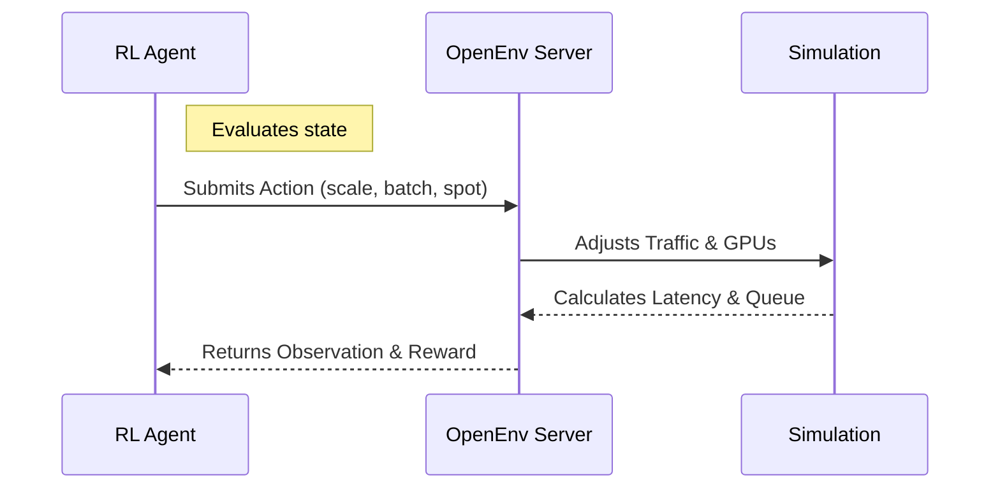

# LLM Serving Autoscaler Environment

An OpenEnv-compliant reinforcement learning environment that simulates traffic-aware GPU autoscaling for Large Language Model (LLM) serving clusters. 

The goal of this environment is to train (or evaluate) an agent that dynamically manages the provisioning of GPUs, batch size configurations, and spot instance allocations to maximize throughput and minimize latency, all while keeping operational costs low under volatile traffic conditions.

## 🎯 The Challenge
Serving LLMs at scale is expensive. Traffic behaves unpredictably (e.g., sine waves, sudden spikes). Agents must learn to:
1. Pre-provision instances before spikes to avoid queue build-ups.
2. Dial back capacity during quiet periods to save on costs.
3. Strategically allocate spot vs. on-demand instances based on task difficulty and risk tolerance.

The environment evaluates agents across three difficulty levels:

### 🏛️ System Architecture



### 🚦 Task Descriptions
| Task Name | Expected Difficulty | Description |
|-----------|--------------------|-------------|
| `easy`    | **Very Low** | Constant, low traffic (~150 req/s). Can be cleanly managed by static GPU provisioning. |
| `medium`  | **Moderate** | Sinusoidal traffic patterns (100–2000 req/s). Requires the agent to anticipate sinusoidal curves to gracefully pre-provision GPUs before traffic hits. |
| `hard`    | **Very High** | Severe, unmanageable traffic spikes (20,000+ req/s) causing inevitable SLA violations. Tests the agent's ability to clamp max capacity and recover gracefully without permanent queuing gridlock. |

### 🏆 Baseline Scores
The included `inference.py` demonstrates a sophisticated condition-based `ReactiveController` that provides a reproducible baseline. It strictly guards against premature down-scaling and safely auto-tunes batch capacities. 

Expected Average Baseline Scores (0.0 to 1.0 bounded):
- **Easy**: `~0.88`
- **Medium**: `~0.82`
- **Hard**: `~0.68`
---

## 🔭 Observation Space

The agent receives a highly detailed state of the serving cluster at each step, defined in `LLMServeObs`:

| Field | Type | Description |
|---|---|---|
| `active_gpus` | Int | Total number of GPUs currently serving traffic. |
| `batch_size` | Int | Current maximum batch size configured for requests. |
| `spot_gpu_ratio` | Float | The ratio of active instances that are cheap spot instances (0.0 to 1.0). |
| `incoming_rate` | Float | Requests per second arriving at the router. |
| `queue_length` | Int | Formatted backlog of requests waiting for GPU availability. |
| `avg_latency` | Float | Average time taken to return responses to users (in ms). |
| `cache_load` | Float | K/V Cache memory utilization percentage (proxy for over/under provisioning). |

---

## 🕹️ Action Space

At each step, the agent returns an `LLMServeAction` adjusting the cluster:

| Field | Type | Description |
|---|---|---|
| `scale` | Int | Scaling decision: `-1` (remove 1 GPU), `0` (do nothing), `1` (add 1 GPU). |
| `batch_size` | Int | Desired maximum queue batching (e.g., `32`, `64`, `128`). Low = fast latency, High = heavy throughput. |
| `spot_allocation` | Float | Target spot instance ratio (`0.0` - `1.0`). High ratio saves cost but risks preemptions under heavy load. |

---

## 🏗️ Setup & Installation

**1. Clone the repository and configure your Python environment:**
```bash
# Recommended: Create a virtual environment
python -m venv venv
source venv/bin/activate  # On Windows: .\venv\Scripts\activate

# Install requirements
pip install -r requirements.txt
```

**2. Configure your Environment Variables:**
The agent relies on an LLM API to operate. Create a `.env` file in the root directory (or export directly) with the following environment variables:

```env
API_BASE_URL="https://router.huggingface.co/v1"  # Or your preferred API endpoint
MODEL_NAME="Qwen/Qwen2.5-72B-Instruct"           # The model executing the inference
HF_TOKEN="your_hugging_face_token"               # Your API Token
LOCAL_IMAGE_NAME="llm-autoscaler-env:latest"     # Docker image tag (if testing via Docker)
```

**3. Run the baseline Inference Script:**
You can test the environment by running the included inference script. This executes a robust baseline `ReactiveController` across all 3 tasks.
```bash
python inference.py
```

## 🐳 Docker Deployment Details
This workspace includes a complete OpenEnv `Dockerfile` and `openenv.yaml`. If Docker is running, the OpenEnv client (`client.py`) will automatically spin up the containerized HTTP server and route API requests seamlessly. If Docker fails or is unavailable, the system safely falls back to Direct Local Mode.
