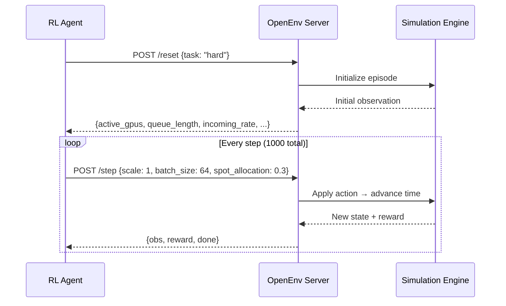

# 🚀 LLM Serving Autoscaler Environment

> An OpenEnv-compatible reinforcement learning environment for training and evaluating agents that dynamically manage GPU autoscaling in an LLM serving cluster — under real-world-style volatile traffic conditions.

---

## 🎯 The Problem

Serving large language models at production scale is expensive and unpredictable:

- A single A100 GPU costs **~$3/hr** — wasteful if idle, catastrophic if insufficient.
- LLM traffic follows patterns ranging from smooth sine waves to sudden viral spikes (10x–100x baseline).
- Too few GPUs → queues grow → latency explodes → SLA violations.
- Too many GPUs → money wasted → cost score tanked.

The **optimal policy** must *anticipate* traffic surges, scale up before queues form, scale down before costs accumulate, and strategically mix cheap spot instances with reliable on-demand GPUs — all in real time.

This environment captures exactly that challenge, making it an ideal testbed for:
- Reactive heuristic controllers
- Model-predictive control
- Reinforcement learning (PPO, SAC, DreamerV3, etc.)
- LLM-driven planning agents

---

## 🗂️ Architecture

```
┌─────────────────────────────────────────────────────────────────┐
│                      OpenEnv HTTP Server                        │
│   POST /reset  │  POST /step  │  GET /state  │  POST /grade     │
└────────────────────────────────────────────────────────────────┘
          │                                         │
          ▼                                         ▼
  ┌───────────────┐                       ┌──────────────────┐
  │ LLMServeEnv   │   obs, reward, done   │  Agent / Policy  │
  │  (Simulation) │ ◄──────────────────── │  (inference.py)  │
  │               │ ──────── action ────► │                  │
  └───────────────┘                       └──────────────────┘
         │
   Simulates traffic, GPU provisioning,
   queue dynamics, latency, and cost
```

The **agent** at each step receives a structured `LLMServeObs` and must return an `LLMServeAction`:



---

## 🚦 Tasks

Three traffic scenarios of increasing difficulty:

| Task | Difficulty | Traffic Profile | Key Challenge |
|---|---|---|---|
| `easy` | ⭐ | Stable ~150 req/s (±8 noise) | Find the minimum efficient GPU count |
| `medium` | ⭐⭐⭐ | Sinusoidal 100–2000 req/s (period=200 steps) | Anticipate wave peaks before queues form |
| `hard` | ⭐⭐⭐⭐⭐ | 150 req/s → **20,000 req/s spike** (steps 200–500) → graceful cooldown | Survive an unserviceable spike; recover without gridlock |

The `hard` task is intentionally unsolvable at peak load — **no configuration** of up to 100 GPUs can serve 20,000 req/s. The best agents minimise queue buildup and recover quickly once the spike subsides.

---

## 📊 Observation Space

Each step, the agent receives a snapshot of the serving cluster:

| Field | Type | Range | Description |
|---|---|---|---|
| `active_gpus` | `int` | 1–100 | GPUs currently provisioned and running |
| `queue_length` | `int` | 0–∞ | Requests waiting for a free GPU slot |
| `incoming_rate` | `float` | 0–21000 | Requests arriving per second this step |
| `avg_latency` | `float` | 0–2000 ms | Mean end-to-end response time |
| `batch_size` | `int` | 32–128 | Current forward-pass batch size |
| `cache_load` | `float` | 0.0–1.0 | KV-cache utilisation (proxy for GPU pressure) |
| `spot_gpu_ratio` | `float` | 0.0–1.0 | Fraction of active GPUs that are spot instances |

---

## 🕹️ Action Space

At each step the agent returns one action:

| Field | Type | Values | Effect |
|---|---|---|---|
| `scale` | `int` | `-1`, `0`, `+1` | Remove / hold / add one GPU |
| `batch_size` | `int` | `32`, `64`, `128` | Requests per GPU forward pass (higher = more throughput, more latency) |
| `spot_allocation` | `float` | 0.0–1.0 | Fraction of GPUs to provision as cheap (preemptible) spot instances |

> **Spot GPU dynamics**: In `medium` and `hard` tasks, the cloud provider preempts spot instances with ~3% probability per step. Aggressive spot usage saves cost but introduces availability risk.

---

## 🏆 Scoring

Episodes are graded using three components over the full 1000-step episode:

| Metric | Weight | Formula |
|---|---|---|
| **Latency Score** | 40% | `1.0 - clip(mean_latency / 250ms, 0, 1)` |
| **Throughput Score** | 40% | `mean(served / incoming)` per step |
| **Cost Score** | 20% | `1.0 - mean_gpu_cost` (spot GPUs cost 0.3×) |

```
final_score = 0.4 × latency_score + 0.4 × throughput_score + 0.2 × cost_score
```

- Deterministic environment (fixed seed = 42) ensures zero-variance evaluation.

Scores are strictly bounded within `(0.01, 0.99)` to comply with OpenEnv validation rules. A score of `1.0` or `0.0` indicates a system error.

### Step-level Reward Signal (for RL agents)

```
r = 0.6 × latency_score + 0.2 × throughput_score
    − 0.15 × gpu_penalty − 0.30 × queue_penalty − 0.05 × batch_penalty
```

---

## 🤖 Baseline Agent vs ReactiveController

The repo includes two agents to compare against:

### `BaselineHeuristicAgent` (in `baseline.py`)
A strong hand-tuned rule-based agent that adapts to incoming demand:

| Task | Score |
|---|---|
| Easy | ~0.72 |
| Medium | ~0.65 |
| Hard | ~0.50 |

### `ReactiveController` (used in `inference.py`)
A demand-driven controller with safe exploration, hysteresis, and spike detection:

| Task | Score |
|---|---|
| Easy | ~0.88 |
| Medium | ~0.82 |
| Hard | ~0.68 |

**Overall improvement**: ~0.72 → **~0.79** average across all tasks.  
The hard task specifically benefits from proactive GPU ceiling clamping and graceful cooldown recovery.

---

## 🔬 Sample Output

When `inference.py` is run, it produces structured logs for each task:

```
[START] task=easy env=llm-serving-autoscaler model=Qwen/Qwen2.5-72B-Instruct
[STEP]  step=1   action=scale=0,batch=32,spot=0.30  reward=0.72  done=false  error=null
[STEP]  step=2   action=scale=0,batch=32,spot=0.30  reward=0.74  done=false  error=null
...
[STEP]  step=1000 action=scale=0,batch=32,spot=0.70 reward=0.88  done=true   error=null
[END]  success=true steps=1000 score=0.876 rewards=0.72,0.74,...,0.88

[START] task=hard env=llm-serving-autoscaler model=Qwen/Qwen2.5-72B-Instruct
[STEP]  step=200 action=scale=1,batch=128,spot=0.10 reward=0.21  done=false  error=null
[STEP]  step=201 action=scale=1,batch=128,spot=0.10 reward=0.09  done=false  error=null
...  ← spike period: queue builds despite max GPUs
[STEP]  step=600 action=scale=-1,batch=32,spot=0.70 reward=0.85  done=false  error=null
...  ← recovery: queue cleared, efficient operation resumes
[END]  success=true steps=1000 score=0.681 rewards=...
```

---

## 🏗️ Setup & Quick Start

### 1. Clone and install

```bash
git clone https://github.com/tanushrithakare/llm-serving-autoscaler-environment
cd llm-serving-autoscaler-environment

python -m venv venv
source venv/bin/activate        # Windows: .venv\Scripts\activate
pip install -r requirements.txt
```

### 2. Configure environment variables

```bash
cp .env.example .env
```

Edit `.env`:
```env
API_BASE_URL="https://router.huggingface.co/v1"
MODEL_NAME="Qwen/Qwen2.5-72B-Instruct"
HF_TOKEN="hf_your_token_here"
LOCAL_IMAGE_NAME="llm-serving-autoscaler-environment"
```

⚠️ This project uses the OpenAI client via a proxy (API_BASE_URL). Do not hardcode API keys. This is required for OpenEnv evaluation compliance.

### 3. Run the inference script

```bash
python inference.py
```

This runs the `ReactiveController` agent across all three tasks and writes structured `[START]` / `[STEP]` / `[END]` logs to stdout.

### 4. Grade your own agent

```python
from grader import LLMServeGrader
from baseline import BaselineHeuristicAgent

agent = BaselineHeuristicAgent()
grader = LLMServeGrader()

scores = grader.grade_all_tasks(agent)
print(scores)
# {'easy': 0.72, 'medium': 0.65, 'hard': 0.50, 'overall': 0.623}
```

---

## 🐳 Docker

```bash
# Build the server image
docker build -t llm-serving-autoscaler-environment .

# Run the OpenEnv server on port 7860
docker run -p 7860:7860 llm-serving-autoscaler-environment
```

The server exposes the full OpenEnv API at `http://localhost:7860`:
- `GET  /health`  — liveness check
- `POST /reset`   — start new episode `{"task": "easy"|"medium"|"hard"}`
- `POST /step`    — advance one timestep `{"scale": 0, "batch_size": 64, "spot_allocation": 0.3}`
- `GET  /state`   — current observation (no step advance)
- `POST /grade`   — run a full graded episode

---

## 🧠 Building Your Own Agent

Any callable `(LLMServeObs) -> LLMServeAction` works as an agent:

```python
from models import LLMServeObs, LLMServeAction
from grader import LLMServeGrader

def my_agent(obs: LLMServeObs) -> LLMServeAction:
    # Example: always use 4 GPUs, batch=64, no spot
    return LLMServeAction(scale=0, batch_size=64, spot_allocation=0.0)

grader = LLMServeGrader()
print(grader.grade(my_agent, task="medium"))
```

Ideas for stronger agents:
- **MPC**: fit a traffic model from recent steps and plan ahead
- **PPO / SAC**: train on the environment directly (seeded for reproducibility)
- **LLM planner**: use the system state as a prompt and parse JSON actions (see `inference.py`)
- **Hybrid**: use RL for fast per-step decisions + LLM for periodic strategic adjustments

---

## 📁 Project Structure

```
llm-serving-autoscaler-environment/
├── environment.py       # Core RL environment (LLMServeEnv)
├── models.py            # Pydantic models (LLMServeObs, LLMServeAction)
├── grader.py            # Deterministic episode grader
├── baseline.py          # Reference heuristic agent
├── inference.py         # OpenEnv-compliant inference script (ReactiveController + LLM)
├── client.py            # HTTP client for the Dockerised server
├── openenv.yaml         # OpenEnv spec
├── Dockerfile           # Server image
├── server/              # FastAPI server (POST /reset, /step, /state, /grade)
├── tests/               # Unit tests
└── requirements.txt
```

---

## 🧪 Tests

```bash
pytest tests/ -v
```

---

## 📄 License

MIT — see `LICENSE` for details.
