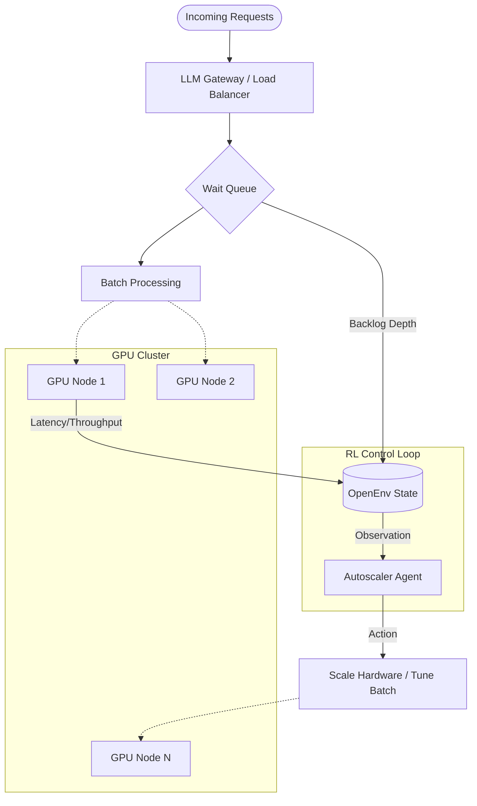

# LLM Serving Autoscaler Environment (OpenEnv)

## 🚀 Overview

This is a high-fidelity **OpenEnv-compatible** reinforcement learning environment that simulates a large-scale AI request serving cluster. 

In real-world LLM deployments (like OpenAI or Hugging Face), traffic is highly variable. If you don't have enough GPUs, latency spikes and users are unhappy. If you have too many, you waste thousands of dollars per hour. This environment challenges an agent to find the **Goldilocks Zone** of resource allocation.

---

## 🏗️ System Architecture

The following diagram illustrates the interaction between the incoming traffic, the request gateway, and the Reinforcement Learning agent (the Autoscaler).



---

## ⚙️ Environment Specifications

### Observation Space (The Signals)
The agent receives a unified state vector representing the cluster health:

| Metric | Type | Description |
| :--- | :--- | :--- |
| `active_gpus` | `int` | Current number of provisioned GPU nodes (1-100). |
| `queue_length` | `int` | Number of requests waiting in the buffer. |
| `incoming_rate` | `float` | Real-time arrival rate (requests per second). |
| `avg_latency` | `float` | Current mean response time in milliseconds. |
| `batch_size` | `int` | Number of sequences processed in a single forward pass. |
| `cache_load` | `float` | KV-Cache memory utilization (0.0 - 1.0). |
| `spot_gpu_ratio`| `float` | Fraction of the cluster running on preemptible instances. |

### Action Space (The Controls)
The agent can modify the cluster configuration on every step:

| Control | Range | Impact |
| :--- | :--- | :--- |
| `scale` | `[-1, 0, 1]` | Add/Remove 1 GPU node or Maintain current capacity. |
| `batch_size` | `[32 - 128]`| Adjust throughput vs. individual request latency. |
| `spot_allocation`| `[0.0 - 1.0]`| Balance cost savings vs. preemption risk. |

---

## 🧠 Reward Formulation
The environment uses a multi-objective reward function to guide the agent toward professional engineering SLAs:

$$ Reward = 0.6(Latency_{score}) + 0.2(Throughput_{score}) - 0.15(GPU_{cost}) - 0.3(Queue_{penalty}) $$

*   **SLA Protection**: Heavily penalizes requests exceeding 200ms latency.
*   **Cost Efficiency**: Incentivizes the use of cheaper "Spot" GPUs.
*   **Chaos Engineering**: In **Medium/Hard** tasks, "Spot Instances" may be suddenly reclaimed (preempted), forcing the agent to adapt to hardware loss.

---

## 📊 Evaluation Tasks

| Task | Traffic Profile | Chaos Level | Difficulty |
| :--- | :--- | :--- | :--- |
| **Easy** | Constant low-load. | None | 🟢 |
| **Medium** | Sinusoidal traffic waves (Day/Night cycle). | Low (3% preemption) | 🟡 |
| **Hard** | Sudden massive burst (Steps 200–500). | High (Symmetry stress) | 🔴 |

### 📈 Verified Baseline Scores
Using the built-in deterministic `BaselineAgent`:

| Task | Score (%) | Performance Status |
| :--- | :--- | :--- |
| **Easy** | **95.2%** | Optimal scaling with zero backlog. |
| **Medium**| **69.6%** | Efficient, with minor spikes during peak waves. |
| **Hard** | **44.1%** | Challenging; agent struggles to catch the burst. |
| **Overall**| **69.6%** | Solid engineering baseline. |

---

## 🎨 Observability Suite

We provide two distinct monitoring layers:

1. **Terminal Ops Dashboard**: A compact ASCII-based monitoring tool (Run `python dashboard.py`).
2. **Production Viz Dashboard**: A professional, Grafana-style Streamlit dashboard with real-time charting (Run `uv run streamlit run app_visual.py`).

---

## 🚀 Quick Submission Guide

1. **Test Locally:** Verify the API interface:
   ```bash
   uv run server
   ```
2. **Validate:** Confirm OpenEnv spec compliance:
   ```bash
   openenv validate .
   ```
3. **Deploy:** Push your environment to Hugging Face:
   ```bash
   openenv push --repo-id your-huggingface-username/llm-serving-autoscaler-env
   ```
4. **Final Step:** Paste your Hugging Face Space URL into the hackathon portal.

---

## 🔮 Future Roadmap (Optional)
* [ ] **VRAM Multi-Tenancy**: Supporting LoRA-adapter switching during inference.
* [ ] **Predictive Scaling**: Integrating LSTM-based "Time-to-Burst" predictions.
* [ ] **Multi-Region Cluster**: Simulating cross-region latency between GPU nodes.

---
Built for the **OpenEnv 2026 Hackathon**
